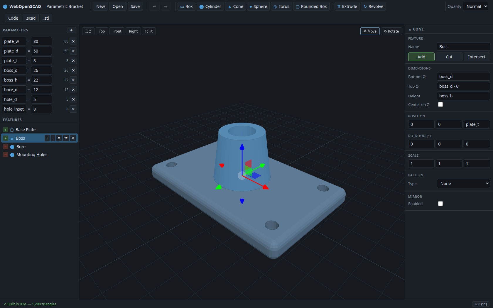

# WebOpenSCAD

A web-based **parametric CAD** frontend for OpenSCAD. Model with a SolidWorks/Fusion-style
feature tree and named parameters — no code required — while OpenSCAD (compiled to
WebAssembly) does the solid geometry in your browser. Nothing is sent to a server.

**▶ Try it live: [falense.github.io/WebOpenSCAD](https://falense.github.io/WebOpenSCAD/)**



## Features

- **Feature history tree** — primitives (box, cylinder, cone, sphere, torus, rounded box)
  and sketch-based features (extrude, revolve with rectangle/circle/polygon profiles),
  combined in order with **Add / Cut / Intersect** operations, exactly like the
  Join/Cut/Intersect workflow in Fusion 360.
- **Direct manipulation in the viewport** — click any feature to select it, then drag
  the move/rotate gizmo. Drags are written back into your expressions: a position of
  `plate_w / 2` becomes `plate_w / 2 + 12.5`, so the model stays parametric even after
  you drag it around. Cut features highlight in red, x-ray style, through walls.
- **Named parameters with expressions** — every field (dimensions, positions, rotations,
  pattern spacing, …) accepts expressions like `plate_w / 2 - hole_inset`. Change one
  parameter and the whole model rebuilds.
- **Linear & circular patterns and mirrors** per feature.
- **Live 3D viewport** (three.js): orbit/pan/zoom, standard views, zoom-to-fit,
  automatic rebuild as you edit.
- **Clean OpenSCAD export** — the generated `.scad` is readable, keeps your parameters
  as variables (works with the OpenSCAD customizer), and can be opened in desktop
  OpenSCAD any time. STL export for printing.
- **Undo/redo, autosave** (localStorage), and project save/load as JSON.
- Runs fully client-side via the official OpenSCAD [nightly WebAssembly builds](https://files.openscad.org/snapshots/)
  with the **Manifold** geometry backend — typical rebuilds take well under a second.

## Getting started

The only prerequisite is [Docker](https://docs.docker.com/get-docker/) with Compose —
node/npm are never run on the host.

```bash
git clone https://github.com/falense/WebOpenSCAD.git
cd WebOpenSCAD

# one-time: install dependencies and download the OpenSCAD WASM engine (~15 MB)
docker compose run --rm web sh -c "npm install && npm run fetch-engine"

# start the dev server with hot reload
docker compose up web
# → http://localhost:5173
```

The app opens with a sample parametric bracket. Things to try:

1. Change `plate_w` in the **Parameters** panel — the whole bracket rebuilds, and the
   mounting holes follow because their positions are expressions of it.
2. Click the **Boss** in the 3D view and drag the gizmo arrows (**M**/**R** switch
   move/rotate, hold **Ctrl** to snap, **Esc** deselects).
3. Add a primitive from the toolbar, set its operation to **Cut**, and reorder it in
   the feature tree — boolean order is part of the history, like any CAD timeline.
4. Open **Code** in the toolbar to see the generated OpenSCAD source live, or export
   it with **.scad** / print it with **.stl**.

### Production build

Served by nginx:

```bash
docker compose --profile prod up prod --build
# → http://localhost:8080
```

### Development tasks

```bash
docker compose run --rm web npm test          # unit tests (expressions, codegen, drag write-back)
docker compose run --rm web npx tsc --noEmit  # typecheck
docker compose run --rm web npm run build     # production bundle to dist/
```

## Controls

| Input | Action |
| --- | --- |
| Left-drag / right-drag / wheel | Orbit / pan / zoom |
| Click feature (viewport or tree) | Select — shows gizmo + highlight |
| Drag gizmo | Move or rotate the feature (one undo step per drag) |
| `M` / `R` | Gizmo mode: move / rotate |
| `Ctrl` (held while dragging) | Snap to 1 mm / 15° |
| `Esc` | Deselect |
| `Ctrl+Z` / `Ctrl+Shift+Z` | Undo / redo |
| `Delete` | Delete selected feature |

## How it works

```
Feature tree + parameters (JSON document)
        │  evaluateDoc()  — validates every expression against the parameter scope
        ▼
generateScad()  — emits readable, parametric OpenSCAD source
        ▼
Web Worker → OpenSCAD WASM → binary STL
        ▼
three.js viewport (STLLoader)
```

The viewport additionally builds invisible **proxy meshes** for every feature directly
from the document (client-side, no compile), which is what makes picking, hover
highlighting, and instant gizmo dragging possible — the compiled STL remains the
ground truth for the boolean result.

Key directories:

| Path | Purpose |
| --- | --- |
| `src/model/` | Document types, expression engine, OpenSCAD code generator |
| `src/engine/` | Compile worker (OpenSCAD WASM) + latest-wins compile queue |
| `src/state/` | zustand store: document, selection, undo/redo, compile state |
| `src/components/` | Toolbar, feature tree, parameters, properties, viewport, code panel |
| `src/viewport/` | Client-side proxy geometry for picking and direct manipulation |
| `public/openscad/` | OpenSCAD WASM engine (fetched by `npm run fetch-engine`, not committed) |

The expression language is a strict subset of OpenSCAD's (numbers, parameters,
`+ - * / % ^`, and functions like `sin`, `cos`, `min`, `max`, `sqrt` — trig in degrees), so
every expression you type is emitted verbatim into the generated `.scad` and stays
parametric outside the app too.
